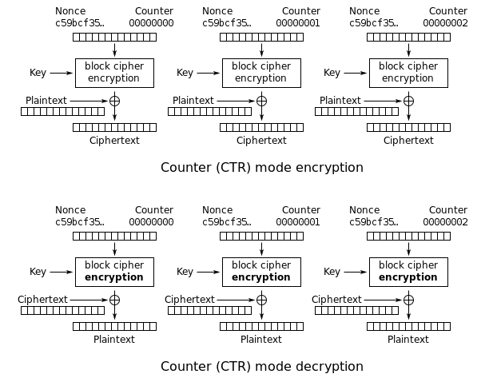
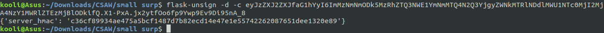

I played with Fword Team in CSAW CTF Qualification Round 2020 and managed to solve all the crypto tasks :partying_face:


To be honnest, I think the tasks were poorly designed and guessy. In this article, I'll provide writeups for:

  - [x] [difib](#difib)
  - [x] [modus_operandi](#modus_operandi)
  - [x] [authy](#authy)
  - [x] [adversarial](#adversarial)
  - [x] [smallsurp](#smallsurp)

> The first task is just XORing two images together so I'll pass on that

# difib


> Hints 
>  1. Length of keys is 25, which (cleaned-up) ramblings would fit that?
>  2. If near-perfect ramblings are used to encrypt in order, how should it be decrypted?
>  3. The guard want's a legible message they can read in!
  
From the challenge's title we can guess that this is going to be about **[bifid cipher]**(https://en.wikipedia.org/wiki/Bifid_cipher). We will need to decode the message give: `snbwmuotwodwvcywfgmruotoozaiwghlabvuzmfobhtywftopmtawyhifqgtsiowetrksrzgrztkfctxnrswnhxshylyehtatssukfvsnztyzlopsv` using a key from the ramblings given:
```
Mr. Jock, TV quiz PhD., bags few lynx
Two driven jocks help fax my big quiz.
Jock nymphs waqf drug vex blitz
Fickle jinx bog dwarves spy math quiz.
Crwth vox zaps qi gym fjeld bunk
Public junk dwarves hug my quartz fox.
Quick fox jumps nightly above wizard.
Hm, fjord waltz, cinq busk, pyx veg
phav fyx bugs tonq milk JZD CREW
Woven silk pyjamas exchanged for blue quartz.
The quick onyx goblin jumps over the lazy dwarf.
Foxy diva Jennifer Lopez wasn’t baking my quiche.
he said 'bcfgjklmnopqrtuvwxyz'
Jen Q. Vahl: bidgum@krw.cfpost.xyz
Brawny gods just flocked up to quiz and vex him.
Emily Q Jung-Schwarzkopf XTV, B.D.
My girl wove six dozen plaid jackets before she quit.
John 'Fez' Camrws Putyx. IG: @kqBlvd
Q-Tip for SUV + NZ Xylem + DC Bag + HW?....JK!
Jumbling vext frowzy hacks pdq
Jim quickly realized that the beautiful gowns are expensive.
J.Q. Vandz struck my big fox whelp
How razorback-jumping frogs can level six piqued gymnasts!
Lumpy Dr. AbcGQVZ jinks fox thew
Fake bugs put in wax jonquils drive him crazy.
The jay, pig, fox, zebra, and my wolves quack!
hey i am nopqrstuvwxzbcdfgjkl
Quiz JV BMW lynx stock derp. Agh! F.
Pled big czar junks my VW Fox THQ
The big plump jowls of zany Dick Nixon quiver.
Waltz GB quick fjords vex nymph
qwertyuioplkjhgfdsazxcvbnm
Cozy lummox gives smart squid who asks for job pen.
zyxwvutsrqponmlkjihgfedcba
Few black taxis drive up major roads on quiet hazy nights.
a quick brown fx jmps ve th lzy dg
Bored? Craving a pub quiz fix? Why, just come to the Royal Oak!
```
For bifid cipher, they key needs to be a perfect pangram with 25 chars long. A perfect pangram is a sentence that uses each letter of the alphabet only one time. 
We can see in our encrypted message that the letter '***j***'  isn't used. That will help us deduce that key doesn't have the letter '***j***' . From the first hint, we have clean up the ramblings, so first of all we will remove every non-alphabetic char and the letter j. With every thing cleaned-up we will have 20 possible keys: 
```
mrocktvquizphdbagsfewlynx
ocknymphswaqfdrugvexblitz
crwthvoxzapsqigymfeldbunk
hmfordwaltzcinqbuskpyxveg
phavfyxbugstonqmilkzdcrew
hesaidbcfgklmnopqrtuvwxyz
enqvahlbidgumkrwcfpostxyz
emilyqungschwarzkopfxtvbd
ohnfezcamrwsputyxigkqblvd
qtipforsuvnzxylemdcbaghwk
umblingvextfrowzyhackspdq
qvandzstruckmybigfoxwhelp
lumpydrabcgqvzinksfoxthew
heyiamnopqrstuvwxzbcdfgkl
quizvbmwlynxstockderpaghf
pledbigczarunksmyvwfoxthq
waltzgbquickfordsvexnymph
qwertyuioplkhgfdsazxcvbnm
zyxwvutsrqponmlkihgfedcba
aquickbrownfxmpsvethlzydg
```
I've tried using each one of them but none worked. Then, I tried using all the keys inverted and successively and got the message.

`xustxsomexunnecessaryxtextxthatxholdsxabsolutelyxnoxmeaningxwhatsoeverxandxbearsxnoxsignificancextoxyouxinxanyxway`

Cleaning up that message we will have: 

`just some unnecessary text that holds absolutely no meaning whatsoever and bears no significance to you in any way`

Sending that to the server gives us the flag.


```python
from secretpy import Bifid
from secretpy import CryptMachine

def encdec(machine, enc):
    dec = machine.decrypt(enc)
    print (dec)
    print("----------------------------------")
    return dec

encrypted = "snbwmuotwodwvcywfgmruotoozaiwghlabvuzmfobhtywftopmtawyhifqgtsiowetrksrzgrztkfctxnrswnhxshylyehtatssukfvsnztyzlopsv"
dict = open("plz","r").readlines()[::-1]
for k in dict:
	k = k.strip()
	cipher = Bifid()
	alphabet = []
	for i in k:		
		alphabet.append(i)
	cm = CryptMachine(Bifid(), 5)
	cm.set_alphabet(alphabet)
	encrypted = encdec(cm,encrypted)
```

### Flag: flag{t0ld_y4_1t_w4s_3z}


# modus_operandi


> Hint
> <200

Connecting to the nc service we are asked to find out if the block cipher used is ECB or CBC. 


It's easy to determine if the block cipher used is ECB or CBC from the ciphertext since we control the plaintext. Since ECB mode encrypts every 16 bytes block independently, two equal plaintext blocks shall result in two equal ciphertext blocks. The problem here is when all queries answered correctly the server doesn't send the flag :frowning_face: . So we have to store our answers and convert them to binary with ECB standing for 0 and CBC standing for 1.


```python
from pwn import remote
from Crypto.Util.number import long_to_bytes

p = remote("crypto.chal.csaw.io",5001)
flag = ""
p.recvline()
for _ in range(176):
	line = p.recvline()
	p.sendline("A"*32)
	data = p.recvline().strip()
	if "Ciphertext" not in data:
		p.interactive()

	print p.recvline()
	data=data.replace("Ciphertext is:  ","")
	if data[:32] == data[32:64]:
		print data, "ecb"
		flag += "0"
		p.sendline('ECB')
	else:
		print data ," cbc"
		p.sendline('CBC')
		flag += "1"
print long_to_bytes(int(flag,2))
p.close()
```

### FLAG: flag{ECB_re@lly_sUck$}


# authy


***handout.py*** 
```python
#!/usr/bin/env python3
import struct
import hashlib
import base64
import flask

# flag that is to be returned once authenticated
FLAG = ":p"

# secret used to generate HMAC with
SECRET = ":p".encode()

app = flask.Flask(__name__)

@app.route("/", methods=["GET", "POST"])
def home():
    return """
This is a secure and private note-taking app sponsored by your favorite Nation-State.
For citizens' convenience, we offer to encrypt your notes with OUR own password! How awesome is that?
Just give us the ID that we generate for you, and we'll happily decrypt it back for you!

Unfortunately we have prohibited the use of frontend design in our intranet, so the only way you can interact with it is our API.

/new

    DESCRIPTION:
        Adds a new note and uses our Super Secure Cryptography to encrypt it.

    POST PARAMS:
        :author: your full government-issued legal name
        :note: the message body you want to include. We won't read it :)

    RETURN PARAMS:
        :id: an ID protected by password  that you can use to retrieve and decrypt the note.
        :integrity: make sure you give this to validate your ID, Fraud is a high-level offense!


/view
    DESCRIPTION:
        View and decrypt the contents of a note stored on our government-sponsored servers.

    POST PARAMS:
        :id: an ID that you can use to retrieve and decrypt the note.
        :integrity: make sure you give this to validate your ID, Fraud is a high-level offense!

    RETURN PARAMS:
        :message: the original unadultered message you stored on our service.
"""

@app.route("/new", methods=["POST"])
def new():
    if flask.request.method == "POST":

        payload = flask.request.form.to_dict()
        if "author" not in payload.keys():
            return ">:(\n"
        if "note" not in payload.keys():
            return ">:(\n"

        if "admin" in payload.keys():
            return ">:(\n>:(\n"
        if "access_sensitive" in payload.keys():
            return ">:(\n>:(\n"

        info = {"admin": "False", "access_sensitive": "False" }
        info.update(payload)
        info["entrynum"] = 783

        infostr = ""
        for pos, (key, val) in enumerate(info.items()):
            infostr += "{}={}".format(key, val)
            if pos != (len(info) - 1):
                infostr += "&"

        infostr = infostr.encode()

        identifier = base64.b64encode(infostr).decode()

        hasher = hashlib.sha1()
        hasher.update(SECRET + infostr)
        return "Successfully added {}:{}\n".format(identifier, hasher.hexdigest())


@app.route("/view", methods=["POST"])
def view():

    info = flask.request.form.to_dict()
    if "id" not in info.keys():
        return ">:(\n"
    if "integrity" not in info.keys():
        return ">:(\n"

    identifier = base64.b64decode(info["id"]).decode()
    checksum = info["integrity"]

    params = identifier.replace('&', ' ').split(" ")
    note_dict = { param.split("=")[0]: param.split("=")[1]  for param in params }

    encode = base64.b64decode(info["id"]).decode('unicode-escape').encode('ISO-8859-1')
    hasher = hashlib.sha1()
    print (encode)
    hasher.update(SECRET + encode)
    gen_checksum = hasher.hexdigest()

    print (checksum)
    print (gen_checksum)
    print (note_dict["entrynum"])

    if checksum != gen_checksum:
        return ">:(\n>:(\n>:(\n"

    try:
        entrynum = int(note_dict["entrynum"])
        if 0 <= entrynum <= 10:

            if (note_dict["admin"] not in [True, "True"]):
                return ">:(\n"
            if (note_dict["access_sensitive"] not in [True, "True"]):
                return ">:(\n"

            if (entrynum == 7):
                return "\nAuthor: admin\nNote: You disobeyed our rules, but here's the note: " + FLAG + "\n\n"
            else:
                return "Hmmmmm...."

        else:
            return """\nAuthor: {}
Note: {}\n\n""".format(note_dict["author"], note_dict["note"])

    except Exception:
        return ">:(\n"

if __name__ == "__main__":
    app.run()
```


In order to access the flag, we need turn admin=True & access_sensitive=True & entrynum=7.

The first two parameters can be easily exploited with url encoding:


The entrynum is set after the info update so we will use [hash_extender](https://github.com/iagox86/hash_extender) to append entrynum=7 in our payload.
```python
        info = {"admin": "False", "access_sensitive": "False" }
        info.update(payload)
        info["entrynum"] = 783
```
Since we don't know the secret length the server is using we need to brute force that until we get our flag! We will get a valid signature for secret length = 13 !


### FLAG: flag{h4ck_th3_h4sh}

# adversarial


In this task we have 21 ciphertexts encrypted using this code:
```python
#!/usr/bin/env python2

import os

import Crypto.Cipher.AES
import Crypto.Util.Counter

from Messager import send


KEY = os.environ['key']
IV = os.environ['iv']

secrets = open('/tmp/exfil.txt', 'r')

for pt in secrets:
    # initialize our counter
    ctr = Crypto.Util.Counter.new(128, initial_value=long(IV.encode("hex"), 16))

    # create our cipher
    cipher = Crypto.Cipher.AES.new(KEY, Crypto.Cipher.AES.MODE_CTR, counter=ctr)

    # encrypt the plaintext
    ciphertext = cipher.encrypt(pt)

    # send the ciphertext
    send(ciphertext.encode("base-64"))
```

If you don't know how AES-CTR works here's a good screenshot from wikipedia. It encypts the nonce (IV) & the counter for each block with the chosen key and xors the result with the plaintext. And the exact same thing happens in decryption! And that's what makes AES-CTR a stream cipher. 

Having many ciphertexts, we only have to guess the key to xor them with to get valid plaintext! We can do this by guessing some possible chars (or words). For example we know that in english texts the most appearing char is the space. That will help is recover parts of the key, then we need to guess some gibberish words to complete our key!
I have used a [script](https://github.com/Jwomers/many-time-pad-attack/blob/master/attack.py) from github with some modifications to do this. (script bellow)

sending `4fb81eac0729a` to the provided server will get us the flag.


```python
import string
import collections
import sets, sys
from base64 import b64decode
from pwn import xor
ciphers=[
"2us8eN+xyfX3m+ouq+Rp51ruXKXYbKCbe5GjrddBHVm0vhKd2KMXMjFWQVclCmNnsGuEhFSOoFRo0hIKHGZrrCS/BRITjW7DJ5L+c0C6Dhu6yBNSnWDpf7sYMknxcaZ+FSwg0nVVNxlNZsfqpd9NOg7FOGsysrh8EIGXZiovI6mLWo9FobtcCDbRZXT7Op5rz7hFynKLtFLIx1GTt4CUrKw6J/tpjTZ9mv/wbBjD5Iwd060oTwfZd4NVg+GdDqyz1PA=",
"w+YyIN+r1brrm/li+7YB5Ey6XbjYbKCbfIej69lAEReh+weex/E7NX1GVEcuWGwyt37Ijk7AjlRt2RlTSDJ0pTHrUQMZiiuHNdy/NUG2BFH/zR5diiWwcqtMJk36P/V4Hi87lztFfwxRI571sYtGd0CEIm5hsbwwGoadIXk+LuCLXoZUp7U=",
"2es4LJm027Kll/h4tPBH6hX/XaubJfjcYpTm5pMPLBGj+xWdhuR+PWIVDhZkGj52oWuL3wrS/hUpnVBfPC555COnRAxckT2aZsi4dx3uB1b5j0wB0CGwPeMYBUD6cbN/ESdslyYYf0xfJIa0tZ5Na1fXdWth6/B8JYeWZj8mJ+KLR5Qa769ID2+MIHzrKtowm6kJnn/OjF/Ok0WWtYbY5axpYKFug31slvDnOV2Br4g=",
"wOYuf56/3/W9yLNxpeoB3Ei9TOqVcLydOpKj64YZQEr39VOlgvAqdHxKXVFjH2Nn/DzQ3AzO5yBswwlfBSNvtySsQEtEznaTd9L+QUCsFhf32ghAiCf1MPYOaRuuf/VHFTM43jhHLAtYIdul6MkWaFHLbF4ktal8HIqANTgtI6WTGN8T/rUOOTLOMT3lf55xw69Mk2rY4ASanQOusZKMrLI2M+ZphiB9y6e8Oludtr0Mxb0oQBuKfY1HlOHHSvXpi/A=",
"xKM8Yd+s0rClv/kh/K1V7U66FuqxNaycPpSyrtoPDBGj+z6Qk/E3LD8PZwJqGXAi5GiNilPAsBVgxBQRD2Z6qzfrXAQJ1m75KYn+fUSpBxf33hVKyTHldb1MOEfxIvVyHiRsij1NKh9RZsrttd9eKQ+GKXky5rU9As+SKi0vNODPDp5PuukODjjTNn7hdZhxzK1awH7OoVjek1GfuYCR4v86Mudtlyo+kvPocErb44QI2OcoaAyeYcAAgq6SGe213P5s3JnNJc1kSHnEoWR7bY4u1Tk0w4uqB4E7zR500Ig+M/mzqTYUVCbAd8ghJVAxA2aKOZ302gtYn1elVRO7ljUCQfo5WdZtdsimmTN1LcLfB0ZAgLxUIeABA+xGChOBG/Q3az9GqUn6s13t8i24ySz+xCl2fDLqZjCanEVWNtIx1D1Fvm3Mt7+45yoANA7lHqnYsS/YwWqSJswOJmVBuLJprfZ33mPGLsf0FXNzaho9cBYioFIQEzUUyQ==",
"zPcpbZyzmrTx3u8j46oPqHi9XeqMfarOOpGiudtcC1n17F3I1bZpdCAfABAySzBn9TPb1hPS/0cpnV07B2ZyqzHrVw4MlDeAMpP+YU22ERf32ghAiCf1Pu55JVz+Mr4zETRsmjRVMVYZE83g8ItGPkCEKG4zo64vUdzEaGB4c7KLH9cO/asdW3eMfC6xNN86kegEkxaB+FnExwOIsZGU9f8nL7V8iSwu0/zhehnS8YxH",
"xeIrad+h1aClm/0n5uRJ6UnuWeqcZ6qPNtWIrtEDWA2uugfRnuwrdGZKXEciC2lnt3+aih2XpgcpwhgeBHk8ky2qUUsVnm7ZKYn+YkCtBxfv0RpRhSWwZKEYJkn0NPV1Ai8h3iFKPgwZIszgsZIReyiKOyo2qagwFc+KKSxqLevEWcdUp/4OCT7bI3j6f4Nhx+hL1iaZvVLFk1eSscGc/royLbV/jjcxl72kaATXtp0B0+l6SB+VLptPg62bQw==",
"2us0b5f42KfskOwxtLFSqEy6GKaZZrvOL5rmv9ZKWBSpthafk6MxMjFbXFd2ECpns2KNnViJqVR92BhfDjNyoCSmQAUImSKAIJC/YgW2ERfv0w9ahCHkdaJBcU3nIad2AzMpmnkCPhZdZsrttd9vNQ+ILWY45q85B4qSKjwuZuTYDoVPu/MODzLaLHPmc4NlgqlH13KLtlOFk3eSsZOdrL4hJbV8lip9l/7rexmdtr0B0+lsQhGLLphP0biQCb/6yLdmzc2MJ9tySXiX9XI0bMY8nAY3loynBsQo0A41yoR3M/m9qCVVTymPbYArLlASBXzEYNTM3k4WlEzkB3Cgl3YOXP0uF85kaZCmgj59JdTfHEhWmbxGJ7IGH6kXMheGHfQgKT9fpxCytErt5yu5yTX+lyk+aXf9fD3Ulk0CY509yWgWo2nW/rW56Q==",
"wOYuf56/3/Wzyrtwp+oB3Ei9TOqVcLydOpKj64gbSEv19VOlgvAqdHxKXVFjH2Nn8j7Y3Q7O5yBswwlfBSNvtySsQEtKzH6SddL+QUCsFhf32ghAiCf1MPgMYRqsf/VHFTM43jhHLAtYIdul5sseaVPLbF4ktal8HIqANTgtI6WdGtcS/LUOOTLOMT3lf55xw69Mk2Ta6AWYnQOusZKMrLI2M+ZphiB9xaW0O1mdtr0Mxb0oQBuKfY1HlOHJSP3oifA=",
"2O07Y42sz7vkiu4u7egB5kLuV6SdNayPNdWkrp5bFxWi+wSZhvd+IHlKDm9jDHQuvCqBnBPAnht8kBUeHiM8sCrrVg4Z2CfUZpqxZwWmDULozB5fj26wRKZRIgj2IvVqHzU+3jlDLAwZJdbkvpxLdUCkKn4ktP0oGYaAank+LuDZS8dJvLtAAnfJMG/mc4NlgqpI0DnA+G7ExgOOtYqdrKs7JbVqjTA40+HtZQaftp0B0+l7WRGLd8xFn6WMUO2j1ash0tjHLp5mXSve7z1td9srnDc9h96lDYBp3A9514lkdqqrrDJAXjaFcYA9JwVoG3LEOtTs2QtUlU/iECax1nYuXP18Q8NqasTyhj48M8KbXllcnvAeaOsdAuxECxeLT/Q2JUhEplS/o1Ss6CHxySD/030fLCTwfS7UgERXOponzGgBtmnFt6SiomcTLEzpGKnYqyXVyCOPLIVdYQ==",
"2es4LLK5zqfshqsr5+RO5EmrSuqMfa6Ae4ypvp5EFhax9VO4x/MsMXdKXAJhF3MpsGOGiB2GtRtkkAkXDWZ5qSC5Qg4SmyuAKZr+eku6Ql70yx5UmyH8MK9WPkX+PawzBC9sij1Hfx1UI8zitZFNPkCKKio1rrh8H4qLMnVqL+uLWY9JrPMODjbOID38coRxgqFakyaGvRfY2luOvMGO6a0gKfpmzw==",
"2es4LLK5zqfshqsr5+RAqF63S76deOPOFZCp5Z57EBiy+wCIlPc7OTFGXQJtDXRnoWSNgkTO5zZ8xF0IACNy5DykUEwOnW7JKI+3cUDzQk71yltfhi/7MK9KPl3xNfkzBygtinVGMFhAKculo5pLZECnOXkoqLgvAs+eIzdmZvHOT4RIquldQXfRJGrxf59xjuhK0iCevVnf1lGJ+sGs5LpzNvB6mGUwmv/gekrc8Mkd3qwoXRuWfoBF0baaXKyo3/5118DFJdkzWWSX8nxifYB5/iAsw4uqF40lnh1wnoh9P6qorDZHXmCQZs80JBVoDWHPbofs30da0EKrBTGmjHYYVagoX8N1L5f/nS95LIvfH0dR0uhaKeZSGq1cGgXSG/U9aD9EvUL6tFao6zzzyRj+wn0+bSH9Mi2b2V5Mfpc6yDwEvWiZt72ltDNBIkirBbWdsC+Z3WaHM4xLb3ATtOEno+4kwybTItv0DHMgfF90dwo3oEIBFT4EyXht/gmmKqUH3+nqpNuKZVNuNm0/luqszUFULuho1emuvPoXHjM1RbVfpVbaag4owD/KTWORtWfxEmGyOVHTj9dPiFPpIhIao69KuE/bryCTW6dp5XkAB64E3PSsQzufz49kHITrz4hNkXPn",
"2es4LJm027Kll/h4tPBH6hX/XaubJfjcYpTm5pMPLBGj+xWdhuR+PWIVDhZkGj52oWuL3wrS/hUpnVBfPC555COnRAxckT2aZsi4dx3uB1b5j0wB0CGwPeMYBUD6cbN/ESdslyYYf0xfJIa0tZ5Na1fXdWth6/B8JYeWZj8mJ+KLR5Qa769ID2+MIHzrKtowm6kJnn/OjF/Ok0WWtYbY5axpYKFug31slvDnOV2Br4g=",
"3uYzeJa91KGljvkt87ZA5V7gGJ6QcLbOOJSo69NADhzmsh3Rhu06dH5aWgJtHiYmqnPInFKGswNowhhfGzJ1qCnrTQoOnGPXL467cQWrDRfu1x5am2Djab1MNEWxcYF7ETRskzBDMQsZMtbkpN9PNRmKIm9hsbh8GY6FIzdtMqXeQJdMuvxJCDOdLG6oaoJ2x6Zd2jOCtE6L0k3alYad4qt9YNxmkiw5lrHwYQ+T24gdxKBwAV6NZolZ0aCNGe2/zLtz3NbCLp5yQ2+X9XVxYY44zjB4jZHkDIoskEpC28x6cvy55CBBSTaJdcUgaBIxTHvDKp320QtQgkzmVSS8nTtbE+olF9B0YYrvgDw8J9WQEwlBmvlfZLIQArgXCx6XFr05d3oLvFi/8V+s8iC2jCTh0i8lInfMejyN2UpQf9IvzikXt2Xb8PCrqytBOUbuUbmXrDjKgSOcK4VXb3ATtOEho/Zg2C3VZsO4FDx0dl90aQE+vxtGBTMJhDAM/QjnKbdJ0qHkttuNYlltc35tnLj/zgBJJe82kP7t8ewXUD56XKMTp0rAaBAo0DWaQGyDtSnxXS66cELTntdImUXwaQ==",
"1+oyYt+T36z2xKt6tOkBzg3jGIvYOO+/e9jm+p4CWCPm9lOjx65+DjECDmAiVSYd5CfIvR3N5yYpnV0tRmZOoTWuRB9G2HaAa9yYNQj/Ixe3nyoTxGChMOMYCwiycYczXWAW3ngCHVgUZuSl/d98e03FHips5o9yUb2WNjwrMr+LFscN790OQHf8ZTCoS80vgvkJnnK0+BqL4QPX9LvYof8RYLgou2Vw08OkJErhtsRJ5A==",
"xKMqY5H/zvXpl+5i4KsB8UK7FOq2cKDAe7CwrsxWWAqvtRSdgqMzNX8PQVAiD2kqpWTImFWP5xxow10MHClzoGW/TQ4Vim7HNJOre0HzQlLs2glKhi71MLlQPgj3MKYzFi85mT1WfxlXZt/itZFaewiEPyolr7g4X8+xMy1qMe3OXIIAu/NLFHfVJGvtOotjy6RM137OoVjek1STuI3Y/6owI/BthWs=",
"3e84bYy9lPXEjasLtLNA+w29WbORe6jCe4aurp5cDAyruR+Ug6MrJH5BDkMiC2krsX6BgFPAsBxswhgdEWZyoSS5SRJcwXeFZpO4NUSzDhfu2ghHyTPlcqRdMlzscbRwEyU8ijBGfwxRI571opBJKQGIbGsy5rEzH4jTJypqMu3OV8dXqulLTTDUM3jmOowiwaBG2jGL9BfOxUaU9IierKs7JewoliAvlrHrZwbKtoge17ttDRGfLphIkLXfH6W1071khdjYa98zQ27W8zBhds020iY7ipGxEMQl2xxw0sIyROK1qDYUTyiJcIAlJgM/CWGKKIH21V9fn03uEXz0kSJXROkvF81jeY3pmyhwOIeZC0dRk/FXJuYTG6BOXxCeDuo9YTMLvFivohiu9CC8nSj/0H0iZDK4fS2cnFlVc4EtlisKvXjH9rSjpDMOP1erAqSLty/UxGDIIo5BInANqOE9pPtwkSrUZs6xHmgga1Q3agEkp1ICUjYJgDBYsBnuNaEI0qzr4o+WaBZwb385lqf/yxVOJfF8nq3H7u4XEnsuXb9ApQXdbhZ8hCjfTniGtW2lRma5OVXJhZBOkE2xZwhe6rdH+VrbtiGYTfV3+GxAB6ELm+m2ACeVjJRzF9D5w4kBnCeqBO3JU6j9ocU/AMmaB0XjMTd13Lh24kzDnOHnMxBHhxTfYe2ki35XEOMP9WYpYBrhcn8S0EYi7uY8Jh6vploUBDM3XGyeNMdkK3YVB+EUPWs1lSuqi0UMuFyqUoxik35l0T2H4KTD2C/hDuIA12nyEFjhfi1EztvK+shdVSd+wL7bLv0DDB1hy/N1w5PTQGtE444gnmRwvhQrZ6vUCSspwQ6FNfIASiAvTs3GWV3ei5By/6GY5s0QTC8Vh9djHGVIPXAgqJ67wOlVgyFR4CWpoDp+yZYfB8vUCsG07kUUVQ==",
"xKQrad+r37Dr3uostKVG7UO6GLqNe6yGe4GuudFaHxHmulOSiO09JnRbSwJ1GWor6iqlilPArxV/1V0aBTZorSCvBQ4SjCfSI9y9eUyvERf7y1tHgSX9MK9WNQj3OKEzHi84ljxMOFhbM8qlsZZcdUC8KX5hsrU5GJ3TNS04I+vMWo8ArvVKTSPVIHT6Op5yx61NkzOcvRfYx0qWuMGa7aw2JLVhj2U80+brewbXtp0B170oRA3ZbJlJnbXfE6P6yKttwMqCa/x2TmrC8ng0d8h5yD05l9LkF4wsx0pi14B+M+S5sjZGGyKFI8E3aAM8HnzEKdT3xAtXgwPtFCOg2DcEE/EzQoJiboqmjD4y",
"yPU4foas0rzrmas2/KVVqEWvS+qZNa2LPJyopddBH1muugDRhu1+MX9LAAJLWHUioSqch1jAohptkB4QBS9yo2vrbEsPnSuAMpS7NUG+EFz02ghAyTPgYqtZNUHxNvszOWA/mzACOx1YMtar/tEOOg6BbHMus/09A4rTJzUmZvHDT5MAvO9PAzPOZXTmOoVr0ehe0ivA",
"2eYueN+136b2n+wntPURvRT8FuqscLyae5ijuM1OHxzm6kPE3rFwdEVKXVYiFWM0t2uPih3R90EwglNfPCNvsGWmQBgPmSnFZs3uIBztTBfO2ghHyS31Y71ZNk2/YOUmSXJi3gFHLAwZK9v2o55JPkDUfD949PN8JYqAMnknI/bYT4BF76oeWG6Paz3cf552gqVMwCGPv1KLghPP7dPWrIs2M+EojCAugPDjbEqCptxQhOcoeRuKesxNlLKMHaq/mu8xkICeZQ==",
"zPB9dZCtmrThm/o39bBE5FTuSL+MOe+aM5Dmu8xAGhWjtlOYlKM9PH5GTUcsWEQysCqfih2BqwZs0RkGSC1yqzLrUgMdjG7ZKYn+dFe6QlD11hVUyTT/MKpXfQj7Prs0BGA7m2oCHhRLI9/hqd9newOEIioyo7h8BYeWZjoiJ+zFDpVFrvhaBDjTfz38cogiwaBM3juNuVuLw1Gft5SK/7AhM7V8iSQp0+LtbgTS+skd3qwoQhCKa5gAnqffHaP637Nu0dDDJZIzSW7E6Hp6fcp5zyU9gJeiCoco0gZsnph9M+WqoSFDUyWMboAoJxchDzPLIJC4xE5Xg0zlW3CVlnYSXucoXs1vL5Dujy88KNTfH0VHl/1WMbIQG6VZGx+cCL0hamoLvF/6pVCopja0hDH90n03YjO4fTuCkERXadI8yT0RuzaV5Liv5y4SbUnkGLOf4z7WjWeBJsBPIXVBpaksvv8k2DCSKM2gEHVueRotbRFnr1YIUj8PxyxDsB7yKLRJz72r4rORfVMtNkU506OsghVVJb1rxeTs6OwLTT40QblSrAXBcxppynreTWGAo2DqXCL8akzWn5tIkE74KApF76ICrVOe+zuZV/V96TUDQegU1OmqQyiCip5iFoP6jI8ZimKnDPfSC+HoutV6WceBVQD3IDN4yals+AuUifLjPxRWnVY="]

for c in range(len(ciphers)):
	ciphers[c]=b64decode(ciphers[c])[64:96]

# XORs two string
def strxor(a, b):     # xor two strings (trims the longer input)
    return "".join([chr(ord(x) ^ ord(y)) for (x, y) in zip(a, b)])


# To store the final key
final_key = [None]*400
# To store the positions we know are broken
known_key_positions = set()

# For each ciphertext
for current_index, ciphertext in enumerate(ciphers):
	counter = collections.Counter()
	# for each other ciphertext
	for index, ciphertext2 in enumerate(ciphers):
		if current_index != index: # don't xor a ciphertext with itself
			for indexOfChar, char in enumerate(strxor(ciphertext, ciphertext2)): # Xor the two ciphertexts
				# If a character in the xored result is a alphanumeric character, it means there was probably a space character in one of the plaintexts (we don't know which one)
				if char in string.printable and char.isalpha(): counter[indexOfChar] += 1 # Increment the counter at this index
	knownSpaceIndexes = []

	# Loop through all positions where a space character was possible in the current_index cipher
	for ind, val in counter.items():
		# If a space was found at least 7 times at this index out of the 9 possible XORS, then the space character was likely from the current_index cipher!
		if val >= 7: knownSpaceIndexes.append(ind)
	#print knownSpaceIndexes # Shows all the positions where we now know the key!

	# Now Xor the current_index with spaces, and at the knownSpaceIndexes positions we get the key back!
	xor_with_spaces = xor(ciphertext,' ')
	for index in knownSpaceIndexes:
		# Store the key's value at the correct position
		final_key[index] = xor_with_spaces[index]
		# Record that we known the key at this position
		known_key_positions.add(index)

# Construct a hex key from the currently known key, adding in '00' hex chars where we do not know (to make a complete hex string)
final_key_hex = ''.join([val if val is not None else '00' for val in final_key])

final_key_hex=final_key_hex
#After correcting words I would get
final_key_hex="45cb256b7cf84ea046fcde1525df62379abf7b33e9409010ce3851289f51d513".decode('hex')

part= '\n'
for c in ciphers:
	#print xor(c,final_key_hex)

	target_cipher=c
	output = strxor(target_cipher,final_key_hex)
	print "\nFix this sentence:"
	msg = ''.join([char if index in known_key_positions else '*' for index, char in enumerate(output)])
	print msg + "\n"
	part += msg +"\n"
	# To correct some words and get a valid key
	print final_key_hex.encode('hex')[:64]
	print xor(c,'t there\'s a difference ').encode('hex')

print part
```

### FLAG: flag{m1ss1on_acc00mpl11shheedd!!}


# smallsurp 


> Hint: The administrators are always taught that sharing is caring when first onboarded.

I have found this challenge really guessy and the admins only released the source code after a lot of time. :weary:

We had a list of admins in database.txt:
```
Jere:
Lakisha:
Loraine:
Ingrid:
Orlando:
Berry:
Alton:
Bryan:
Kathryn:
Brigitte:
Dannie:
Jo:
Leslie:
Adrian:
Autumn:
Kellie:
Alphonso:
Joel:
Alissa:
Rubin:
```
and an encrypted "password" in encrypted.txt
```
cbc:254dc5ae7bb063ceaf3c2da953386948:08589c6b40ab64c434064ec4be41c9089eefc599603bc7441898c2e8511d03f6
```
The source code is long so I'll only mention interesting parts.

First, the server is getting the password of the corresponding user and calculating a ***server_hmac***
 ```python
        xH = hasher(salt + str(pwd))
        v = modular_pow(g, xH, N)
        B = (k * v + modular_pow(g, b, N)) % N
        u = hasher(str(A) + str(B))
        S = modular_pow(A * modular_pow(v, u, N), b, N)
        K = hashlib.sha256(str(S).encode()).digest()
        flask.session["server_hmac"] = hmac_sha256(K, salt.encode())
        return flask.jsonify(nacl=salt, token2=B)
 ```
Then, to connect to the dashboard at ```/dash/<user>``` the server checks if the server_hmac equals the hmac provided.
```python
@app.route("/dash/<user>", methods=["POST", "GET"])
def dashboard(user):
    if "hmac" not in flask.request.args:
        flask.flash("Error encountered on server-side.")
        return flask.redirect(flask.url_for("home"))

    hmac = flask.request.args["hmac"]
    servermac = flask.session.get("server_hmac", None)
    print(hmac, servermac)
    if hmac != servermac:
        flask.flash("Incorrect password.")
        return flask.redirect(flask.url_for("home"))

    pwd = DATABASE[user]
    return flask.render_template("dashboard.html", username=user, pwd=pwd)
```
Trying to login with the first user Jere, with any password we will get the token2 and salt and the session cookie:

Using flask-usign we can retrieve back the server_hmac for Jere:

With the server_hmac retrieved we can connect to Jere's dahsbord using this link http://crypto.chal.csaw.io:5005/dash/Jere?hmac=c36cf89934ae475a5bcf1487d7b82ecd14e47e1e55742262087651dee1320e89

Once connected we can get Jere's password `1:c4ee528d1e7d1931e512ff263297e25c:128`
Retrieving all users password we get:
```
Jere 1:c4ee528d1e7d1931e512ff263297e25c:128
Loraine 3:7180fe06299e1774e0a18f48441efdaf:128
Ingrid 4:48359d52540614247337a5a1191034a7:128
Orlando 5:1fcd4a7279840854989b7ad086354b21:128
Berry 6:f69f8e4ecde704a140705927160751d1:128
Alton 7:b0ca40dc161b1baa61930b6b7c311c30:128
Bryan 8:04ed6f6bf5ec8c8c2a4d18dcce04ae48:128
Kathryn 9:430ad338b7b603d1770f94580f23cb38:128
Brigitte 10:d51669551515b6d31ce3510de343370f:128
Dannie 11:b303ee7908dcbc07b8e9dac7e925a417:128
Jo 12:3c4a692ad1b13e27886e2b4893f8d761:128
Leslie 13:a8e53ef9ee51cf682f621cb4ea0cb398:128
Adrian 14:feb294f9380c462807bb3ea0c7402e12:128
Autumn 15:9b2b15a72430189048dee8e9594c9885:128
Kellie 16:f4d52e11f6f9b2a4bfbe23526160fdfd:128
Alphonso 17:d0f902472175a3f2c47a88b3b3108bb2:128
Joel 18:cc29eb96af9c82ab0ba6263a6e5a3768:128
Alissa 19:913227d2d7e1a01b4ec52ff630053b73:128
Rubin 20:8669dd2b508c2a5dfd24945f8577bd62:128
```
From the hint shared `The administrators are always taught that sharing is caring when first onboarded.` or with a bit of guess we will use those passwords as sharings for Shamir's secret sharing. 20 shares should be enough to retrieve back the secret.

Once that secret retrieved we will used it as a key to decrypt the encrypted.txt with `CBC` as AES mode, and `254dc5ae7bb063ceaf3c2da953386948` as the IV.


```python
from Crypto.Cipher import AES
from binascii import unhexlify
from Crypto.Protocol.SecretSharing import Shamir

shares = ['c4ee528d1e7d1931e512ff263297e25c','4b58b8b5285d2e8642a983881ed28fc7','7180fe06299e1774e0a18f48441efdaf','48359d52540614247337a5a1191034a7','1fcd4a7279840854989b7ad086354b21','f69f8e4ecde704a140705927160751d1','b0ca40dc161b1baa61930b6b7c311c30','04ed6f6bf5ec8c8c2a4d18dcce04ae48','430ad338b7b603d1770f94580f23cb38','d51669551515b6d31ce3510de343370f','b303ee7908dcbc07b8e9dac7e925a417','3c4a692ad1b13e27886e2b4893f8d761','a8e53ef9ee51cf682f621cb4ea0cb398','feb294f9380c462807bb3ea0c7402e12','9b2b15a72430189048dee8e9594c9885','f4d52e11f6f9b2a4bfbe23526160fdfd','d0f902472175a3f2c47a88b3b3108bb2','cc29eb96af9c82ab0ba6263a6e5a3768','913227d2d7e1a01b4ec52ff630053b73','8669dd2b508c2a5dfd24945f8577bd62']

for i in range(20):
	shares[i]=(i+1,int(shares[i],16))

key = Shamir.combine(shares)
print ("secret: "+key)

IV= unhexlify("254dc5ae7bb063ceaf3c2da953386948")
enc= unhexlify("08589c6b40ab64c434064ec4be41c9089eefc599603bc7441898c2e8511d03f6")
cipher = AES.new(key,AES.MODE_CBC,IV)
print (cipher.decrypt(enc))
```

### FLAG: flag{n0t_s0_s3cur3_4ft3r_4ll}
