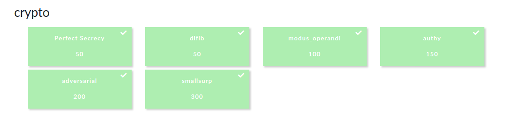

I played with Fword Team in CSAW CTF Qualification Round 2020 and managed to solve all the crypto tasks :partying_face:


To be honnest, I think the tasks were poorly designed and guessy. In this article, I'll provide writeups for:

  - [x] difib
  - [x] modus_operandi
  - [x] authy
  - [x] adversarial
  - [x] smallsurp

# difib


> Hints 
>  1. Length of keys is 25, which (cleaned-up) ramblings would fit that?
>  2. If near-perfect ramblings are used to encrypt in order, how should it be decrypted?
>  3. The guard want's a legible message they can read in!
  
From the challenge's title we can guess that this is going to be about **[bifid cipher]**(https://en.wikipedia.org/wiki/Bifid_cipher). We will need to decode the message give: `snbwmuotwodwvcywfgmruotoozaiwghlabvuzmfobhtywftopmtawyhifqgtsiowetrksrzgrztkfctxnrswnhxshylyehtatssukfvsnztyzlopsv` using a key from the ramblings given:
```
Mr. Jock, TV quiz PhD., bags few lynx
Two driven jocks help fax my big quiz.
Jock nymphs waqf drug vex blitz
Fickle jinx bog dwarves spy math quiz.
Crwth vox zaps qi gym fjeld bunk
Public junk dwarves hug my quartz fox.
Quick fox jumps nightly above wizard.
Hm, fjord waltz, cinq busk, pyx veg
phav fyx bugs tonq milk JZD CREW
Woven silk pyjamas exchanged for blue quartz.
The quick onyx goblin jumps over the lazy dwarf.
Foxy diva Jennifer Lopez wasn’t baking my quiche.
he said 'bcfgjklmnopqrtuvwxyz'
Jen Q. Vahl: bidgum@krw.cfpost.xyz
Brawny gods just flocked up to quiz and vex him.
Emily Q Jung-Schwarzkopf XTV, B.D.
My girl wove six dozen plaid jackets before she quit.
John 'Fez' Camrws Putyx. IG: @kqBlvd
Q-Tip for SUV + NZ Xylem + DC Bag + HW?....JK!
Jumbling vext frowzy hacks pdq
Jim quickly realized that the beautiful gowns are expensive.
J.Q. Vandz struck my big fox whelp
How razorback-jumping frogs can level six piqued gymnasts!
Lumpy Dr. AbcGQVZ jinks fox thew
Fake bugs put in wax jonquils drive him crazy.
The jay, pig, fox, zebra, and my wolves quack!
hey i am nopqrstuvwxzbcdfgjkl
Quiz JV BMW lynx stock derp. Agh! F.
Pled big czar junks my VW Fox THQ
The big plump jowls of zany Dick Nixon quiver.
Waltz GB quick fjords vex nymph
qwertyuioplkjhgfdsazxcvbnm
Cozy lummox gives smart squid who asks for job pen.
zyxwvutsrqponmlkjihgfedcba
Few black taxis drive up major roads on quiet hazy nights.
a quick brown fx jmps ve th lzy dg
Bored? Craving a pub quiz fix? Why, just come to the Royal Oak!
```
For bifid cipher, they key needs to be a perfect pangram with 25 chars long. A perfect pangram is a sentence that uses each letter of the alphabet only one time. 
We can see in our encrypted message that the letter '***j***'  isn't used. That will help us deduce that key doesn't have the letter '***j***' . From the first hint, we have clean up the ramblings, so first of all we will remove every non-alphabetic char and the letter j. With every thing cleaned-up we will have 20 possible keys: 
```
mrocktvquizphdbagsfewlynx
ocknymphswaqfdrugvexblitz
crwthvoxzapsqigymfeldbunk
hmfordwaltzcinqbuskpyxveg
phavfyxbugstonqmilkzdcrew
hesaidbcfgklmnopqrtuvwxyz
enqvahlbidgumkrwcfpostxyz
emilyqungschwarzkopfxtvbd
ohnfezcamrwsputyxigkqblvd
qtipforsuvnzxylemdcbaghwk
umblingvextfrowzyhackspdq
qvandzstruckmybigfoxwhelp
lumpydrabcgqvzinksfoxthew
heyiamnopqrstuvwxzbcdfgkl
quizvbmwlynxstockderpaghf
pledbigczarunksmyvwfoxthq
waltzgbquickfordsvexnymph
qwertyuioplkhgfdsazxcvbnm
zyxwvutsrqponmlkihgfedcba
aquickbrownfxmpsvethlzydg
```
I've tried using each one of them but none worked. Then, I tried using all the keys inverted and successively and got the message.

`xustxsomexunnecessaryxtextxthatxholdsxabsolutelyxnoxmeaningxwhatsoeverxandxbearsxnoxsignificancextoxyouxinxanyxway`

Cleaning up that message we will have: 

`just some unnecessary text that holds absolutely no meaning whatsoever and bears no significance to you in any way`

Sending that to the server gives us the flag.


```python
from secretpy import Bifid
from secretpy import CryptMachine

def encdec(machine, enc):
    dec = machine.decrypt(enc)
    print (dec)
    print("----------------------------------")
    return dec

encrypted = "snbwmuotwodwvcywfgmruotoozaiwghlabvuzmfobhtywftopmtawyhifqgtsiowetrksrzgrztkfctxnrswnhxshylyehtatssukfvsnztyzlopsv"
dict = open("plz","r").readlines()[::-1]
for k in dict:
	k = k.strip()
	cipher = Bifid()
	alphabet = []
	for i in k:		
		alphabet.append(i)
	cm = CryptMachine(Bifid(), 5)
	cm.set_alphabet(alphabet)
	encrypted = encdec(cm,encrypted)
```

### Flag: flag{t0ld_y4_1t_w4s_3z}

# modus_operandi


> Hint
> <200

Connecting to the nc service we are asked to find out if the block cipher used is ECB or CBC. 


It's easy to determine if the block cipher used is ECB or CBC from the ciphertext since we control the plaintext.
