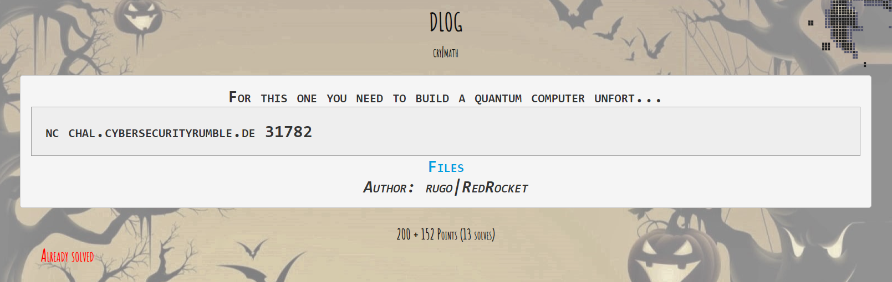
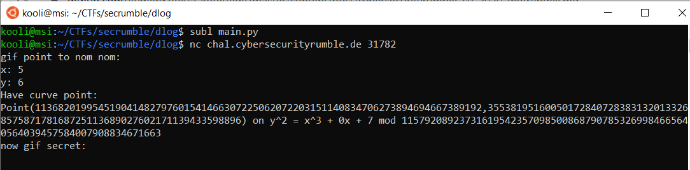
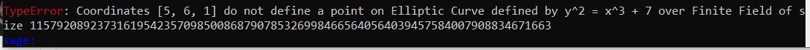
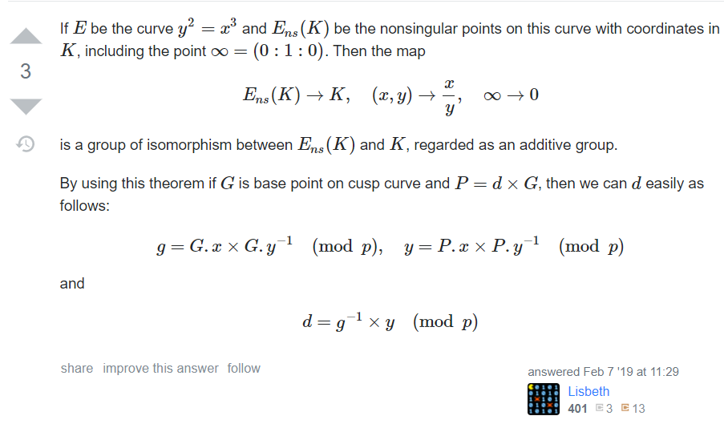
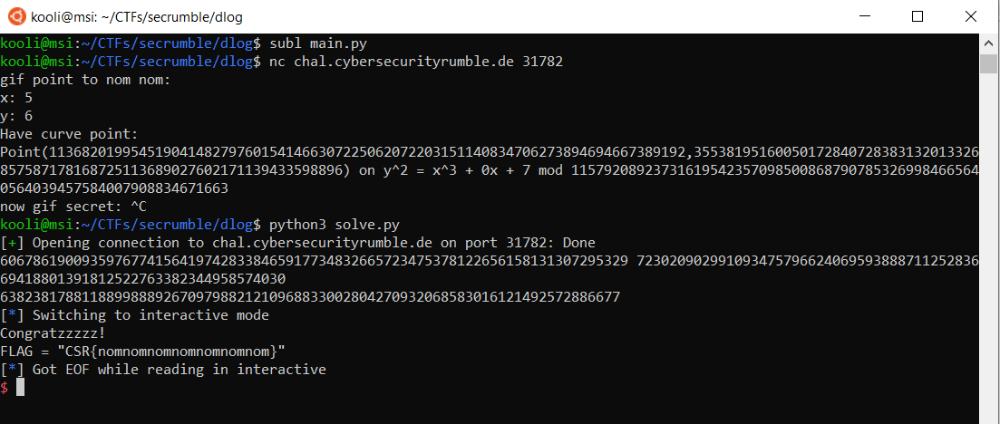

# Description
### 200 + 152 Points (13 solves)
### For this one you need to build a quantum computer unfort...
### nc chal.cybersecurityrumble.de 31782
### Author: rugo|RedRocket
### Files: [main.py](main.py)



# Overview

Reading the provided [source code](main.py) we can notice the server is using the secp256k1 curve:

```python
a = 0
b = 7
p = 0xfffffffffffffffffffffffffffffffffffffffffffffffffffffffefffffc2f

secp256k1 = EllipticCurve(a, b, p)
```

Then the server asks us to provide a point and it uses as a generator:

```python
print("gif point to nom nom:")
x = input("x: ")
y = input("y: ")

if len(x) > 78 or len(y) > 78:
    print("values too large!")
    exit(0)

G = AffinePoint(
        secp256k1,
        int(x), int(y)
)

secret = int.from_bytes(os.urandom(32), "big")

print("Have curve point: ")
print(secret * G)

user_secret = int(input("now gif secret: "))

if secret == user_secret:
    print("Congratzzzzz!")
    print(open("/opt/flag.txt").read())
else:
    print("Nein!")
```

It's obvious here, we need to provide the randomly chosen server's secret to be able to get to the flag. Well, easier said than done.. The secp256k1 curve is known to be a secure curve as it is actually being used in bitcoin. Computing the Discrete log will be pretty hard and will take ages. Let's try to connect to nc service and give a random point:



Wait what ? How are those values accepted by the server ? I don't think the point (5,6) belongs to the curve! Double checking in sage because why not:



Yes! It doesn't belong to the curve so this must be a fault attack as the server doesn't check if the provided point is on the curve or not!

# Exploitation

Now we know where that server is vulnerable but how to exploit it? There are several attack using the chinese remainder theorem and chosing an invalid curve but those only succeed when the secret is static and not randomly chosen at every new connection. You can read about them [here](https://blog.trailofbits.com/2018/08/01/bluetooth-invalid-curve-points/) if you are interested. 

After hours of searching I came by an excellent [answer on crypto.stackexchange](https://crypto.stackexchange.com/questions/61302/how-to-solve-this-ecdlp/67120#67120):



We can set b=0 to create our new invalid curve $$y^2=x^3$$ and randomly choose a point at our new curve. I chose (4,8) as :

$$8^2=4^^3=64$$

Now to compute our secret d we need:

$$g=G.x G^{-1} (mod p)$$
$$y=P.x P.y^{-1} (mod p)$$
and then:
$$d=g^{-1} y (mod p)$$

**CODE TIME**
```python
from Crypto.Util.number import inverse
from pwn import remote

HOST = "chal.cybersecurityrumble.de"
PORT = 31782

P = 115792089237316195423570985008687907853269984665640564039457584007908834671663
gx = 4
gy = 8

p = remote(HOST, PORT)
p.recvuntil("x: ")
p.sendline(str(gx))
p.recvuntil("y: ")
p.sendline(str(gy))
p.recvuntil("(")
px = int(p.recvuntil(',')[:-1])
py = int(p.recvuntil(')')[:-1])
print (px,py)
p.recvuntil("secret: ")
g = gx*inverse(gy,P)%P
y = px*inverse(py,P)%P
d = inverse(g,P)*y%P
print (d)
p.sendline(str(d))
p.interactive()
```


And Voilà we got our super creative flag!

# FLAG : CSR{nomnomnomnomnomnomnom}

I really liked this challenge as I learned a lot spending hours of reading about invalid curves attacks! So many thanks to the authors.
