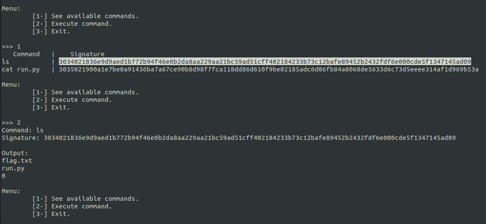
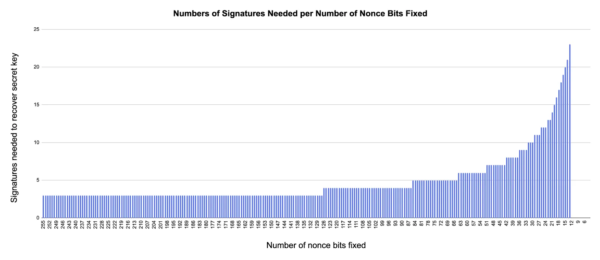
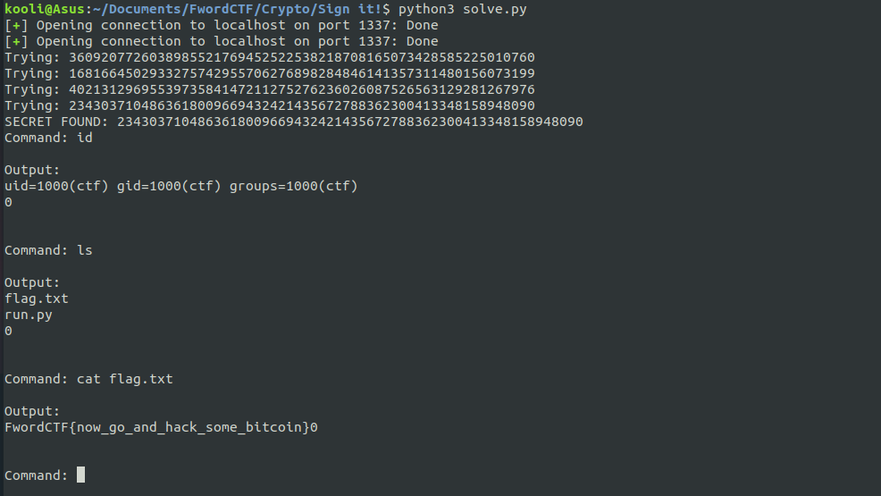

# Description
### 500 points (6 solves)
### nc signit.fword.wtf 1337
**Author:** `KOOLI`


# Overview

 
 
 Connecting to the provided nc service we can see we have two possibilities:
 1. See available commands:
   - ls
   - cat run.py
2. Execute command:
   - ls :
      - `flag.txt`
      - `run.py`
   - cat run.py
   
```python 
#!/usr/bin/python3

from Crypto.Util.number import bytes_to_long
from binascii import hexlify, unhexlify
from random import randrange
from hashlib import sha1
import os
import ecdsa


class Ellip(object):
	def __init__(self):
		# NIST Curve P-192 for da speed:
		_p = 6277101735386680763835789423207666416083908700390324961279
		_r = 6277101735386680763835789423176059013767194773182842284081
		_b = 0x64210519E59C80E70FA7E9AB72243049FEB8DEECC146B9B1
		_Gx = 0x188DA80EB03090F67CBF20EB43A18800F4FF0AFD82FF1012
		_Gy = 0x07192B95FFC8DA78631011ED6B24CDD573F977A11E794811
		curve_192 = ecdsa.ellipticcurve.CurveFp(_p, -3, _b, 1)
		generator_192 = ecdsa.ellipticcurve.PointJacobi(
		    curve_192, _Gx, _Gy, 1, _r, generator=True
		)
		g = generator_192
		n = g.order()
		secret = randrange(1, n)
		self.pubkey = ecdsa.ecdsa.Public_key(g, g * secret)
		self.privkey = ecdsa.ecdsa.Private_key(self.pubkey, secret)
		self.nonce = randrange(1, n)

	def ephemere_key(self):
		return self.nonce ^ randrange(1, 2**150)

	def sign(self, command):
		_k = self.ephemere_key()
		c_int = bytes_to_long(sha1(command.encode()).digest())
		signature = self.privkey.sign(c_int, _k)
		return hexlify(ecdsa.util.sigencode_der(signature.r, signature.s, self.pubkey.generator.order()))

	def valid_sig(self, command , signature):
		signature = unhexlify(signature)
		r , s = ecdsa.util.sigdecode_der(signature, self.pubkey.generator.order())
		signature = ecdsa.ecdsa.Signature(r, s)
		c_int = bytes_to_long(sha1(command.encode()).digest())
		if self.pubkey.verifies(c_int, signature):
			return True
		return False

	def execute_command(self, command, signature):
		if self.valid_sig(command, signature):
			print("\nOutput: ")
			print(os.system(command))
		else:
			print("\nIncorrect signature.")

	def available_commands(self):
		available = ['ls','cat run.py']
		print("   Command   |    Signature")
		for cmd in available:
			signature = self.sign(cmd)
			print (f'{cmd:12} | {signature.decode()}')


def menu():
	print ("\nMenu:")
	print ("\t[1-] See available commands.")
	print ("\t[2-] Execute command.")
	print ("\t[3-] Exit.\n")

def main():
	try:
		E = Ellip()
		while True:		
			menu()
			choice = int(input(">>> ").strip())
			if choice == 1:
				E.available_commands()
			elif choice == 2:
				cmd = input("Command: ").strip()
				signature = input("Signature: ").strip()
				E.execute_command(cmd , signature)
			else:
				exit()
	except Exception:
		print("\nAn Exception occured. What are you trying to do?")
		exit()
if __name__ == '__main__':
	main()
```

Okay, from the source code we can see that the server is using the **NIST Curve P-192** and **der** encoded signatures for each command.
Our goal is clear; we need to sign the command `cat flag.txt` in order to execute it on the server. But to do that we need to recover the Private Key  :pensive: !

Digging more into the source code we can spot the ephemere_key() implementation used to sign the commands `ls` and `cat run.py`:

```python
def ephemere_key(self):
		return self.nonce ^ randrange(1, 2**150)
```

The nonce being ~ 192 bits long, the ephemere_key will always have the 42 MSBs fixed! That must be the vulnerability we need to exploit in order to recover the private key.

We know that:

$$s_1 = k_1^{-1} (m_1 +xr_1)$$
$$s_2 = k_2^{-1} (m_2 +xr_2)$$
$$...$$
$$s_n = k_n^{-1} (m_n +xr_n)$$
$$s_1 k_1 = m_1 + xr_1   and   s_n k_n = m_n + xr_n$$
$$k_1 = s_1^{-1}(m_1 + xr_1)   and   k_n = s_n^{-1}(m_n+xr_n)$$
$$k_1 - k_n = s_1^{-1}(m_1 +xr_1) - s_n^{-1}(m_n + xr_n)$$
$$s_1 s_n (k_1 - k_n) = s_n (m_1 + xr_1) - s_1^{-1} (m_n +x r_n)$$
$$s_1 s_n (k_1 - k_n) = x s_n r_1 - x s_1 r_n +s_n m_1 -s_1 m_n$$
$$x(s_1 r_n - s_n r_1) = s_n m_1 -s_1 m_n -s_1 s_n (k_1 -k_n)$$
$$x = (r_n s_1 - r_1 s_n)^{-1} (s_n m_1 - s_1 m_n - s_1 s_n (k_1 - k_n))$$

From this [article](https://blog.trailofbits.com/2020/06/11/ecdsa-handle-with-care/), using `LLL` we can successfully recover the secret x but we need at least 6 signatures for 42 bits fixed and we only have two commands available.

 
 
 Going back to the source code again, we can see that the available commands are resigned each time with a new ephemere_key. Bingo! So we can grab as many signatures as we want!

# Exploitation

What we need to do is:
- [x] Store 6 commands with their signatures.
- [x] Crack potentiel keys using LLL.
- [x] Recovering the correct private key.
- [x] Execute any command we want!



```python
#!/usr/bin/python3

import ecdsa
from binascii import hexlify, unhexlify
from random import randrange
from Crypto.Util.number import bytes_to_long, inverse
from hashlib import sha1
from pwn import process, remote
import olll


def store(p):
	sigs = []
	msgs = [] 
	for _ in range(3):
		p.recvuntil(">>> ")
		p.sendline("1")
		p.recvline()
		#Store signatures with correspondings msgs
		for _ in range(2):
			line = p.recvline().decode()
			msg = line.split("|")[0].strip().encode()
			sig = line.split("|")[1].strip()
			msgs.append(bytes_to_long(sha1(msg).digest()))
			sig = ecdsa.util.sigdecode_der(unhexlify(sig), n)
			sigs.append(sig)
	return sigs , msgs

def prepare_matrix(sigs, msgs,n):
	matrix = [[n, 0, 0, 0, 0, 0, 0],
	[0, n, 0, 0, 0, 0, 0],
	[0, 0, n, 0, 0, 0, 0],
	[0, 0, 0, n, 0, 0, 0],
	[0, 0, 0, 0, n, 0, 0]]
	 
	row, row2 = [], []
	[msgn, rn, sn] = [msgs[-1], sigs[-1][0], sigs[-1][1]]
	rnsn_inv = rn * inverse(sn, n)
	mnsn_inv = msgn * inverse(sn, n)

	for i in range(5):
		row.append((sigs[i][0] * inverse(sigs[i][1], n)) - rnsn_inv)
		row2.append((msgs[i] * inverse(sigs[i][1], n)) - mnsn_inv)

	row.append((2**150) / n)
	row.append(0)
	row2.append(0)
	row2.append(2**150)
	 
	matrix.append(row)
	matrix.append(row2)

	return matrix, [msgn, rn, sn]
 
def crack_potential_keys(new_matrix, msgn, rn, sn, n):
	keys = []
	for row in new_matrix:
		potential_nonce_diff = row[0]

		potential_priv_key = (sn * msgs[0]) - (sigs[0][1] * msgn) - (sigs[0][1] * sn * potential_nonce_diff)
		keys.append(potential_priv_key%n)
		potential_priv_key *= inverse((rn * sigs[0][1]) - (sigs[0][0] * sn), n)
		keys.append(potential_priv_key%n)
	return keys

def sign(privkey, pubkey, command):
	_k = randrange(1, 2**150)
	c_int = bytes_to_long(sha1(command.encode()).digest())
	signature = privkey.sign(c_int, _k)
	return hexlify(ecdsa.util.sigencode_der(signature.r, signature.s, pubkey.generator.order()))

def recover_keys(keys, p):
	_p = 6277101735386680763835789423207666416083908700390324961279
	_r = 6277101735386680763835789423176059013767194773182842284081
	_b = 0x64210519E59C80E70FA7E9AB72243049FEB8DEECC146B9B1
	_Gx = 0x188DA80EB03090F67CBF20EB43A18800F4FF0AFD82FF1012
	_Gy = 0x07192B95FFC8DA78631011ED6B24CDD573F977A11E794811
	curve_192 = ecdsa.ellipticcurve.CurveFp(_p, -3, _b, 1)
	generator_192 = ecdsa.ellipticcurve.PointJacobi(
	    curve_192, _Gx, _Gy, 1, _r, generator=True
	)
	g = generator_192
	
	for key in keys:
		print ("Trying: ",end='')
		print (key)
		p.recvuntil(">>> ")
		p.sendline("2")
		pubkey = ecdsa.ecdsa.Public_key(g, g * key)
		privkey = ecdsa.ecdsa.Private_key(pubkey, key)
		sig = sign(privkey, pubkey, 'ls')
		p.recvuntil("Command: ")
		p.sendline('ls')
		p.recvuntil("Signature: ")
		p.sendline(sig)
		p.recvline()
		response = p.recvline().decode()
		if "Incorrect signature." not in response:
			print("SECRET FOUND: ",end='')
			print (key)
			return privkey , pubkey
	print ("Operation failed")
	exit()

def execute_command(privkey, pubkey, command, p):
	p.recvuntil(">>> ")
	p.sendline("2")
	sig = sign(privkey, pubkey, command)
	p.recvuntil("Command: ")
	p.sendline(command)
	p.recvuntil("Signature: ")
	p.sendline(sig)
	output = p.recvuntil("Menu:").decode().replace("Menu:","")
	print (output)


# The Order
n = 6277101735386680763835789423176059013767194773182842284081

#p = process(['./run.py'])
p = remote('signit.fword.wtf',1337)

sigs , msgs = store(p)
matrix, [msgn, rn, sn]= prepare_matrix(sigs, msgs,n)
new_matrix = olll.reduction(matrix, 0.75)
keys = crack_potential_keys(new_matrix, msgn, rn, sn, n)
privkey , pubkey = recover_keys(keys, p)
while True:
	command = input("Command: ").strip()
	execute_command(privkey, pubkey, command, p)
```

## FLAG: FwordCTF{now_go_and_hack_some_bitcoin}
